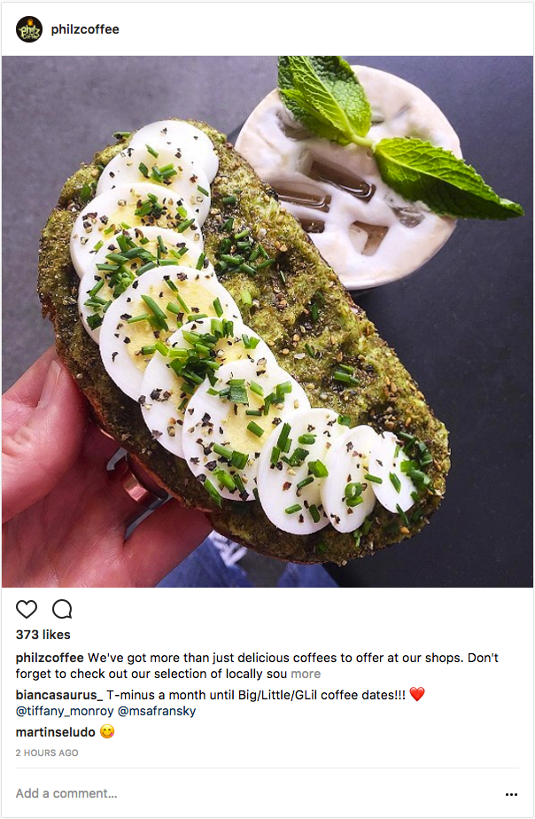

# React-InstaClone

### Application Description:

This application tests current knowledge of React by creating an instagram-like application that focused on React UI and core functionalities. This included adding comments with a hard-coded user name, searching for a username's posts and using React Higher Order Components to toggle between being logged in and being logged out. 

### Deployment
Client: [React-InstaClone](https://react-instaclone.netlify.com/)

Clone specified mockups:

**Search bar:** 

**Post container:** 

Frontend Built Using:

- React.js

- Dependecies:
    - [react](https://reactjs.org/docs/getting-started.html)
    - [prop-types](https://www.npmjs.com/package/prop-types)
    - [font-awesome icons](https://fontawesome.com/how-to-use/on-the-web/setup/using-package-managers)

### Using the Application

Requirements:
- [Node](https://nodejs.org/en/docs/)
- Package Manager such as [**Yarn**](https://yarnpkg.com/en/docs) or [**npm**](https://docs.npmjs.com/)
    - **Yarn** was used to build this project.

Have node?? Have Yarn or npm?? 

Follow these steps:

1. Fork and clone repo
2. Run `yarn install` to install the necessary dependencies on the frontend.
3. Run `yarn start` to run the frontend on `localhost:3000`
4. Your application is now running and can be tested locally. 

<a href="#"><strong>Back To Top</strong></a>
 

